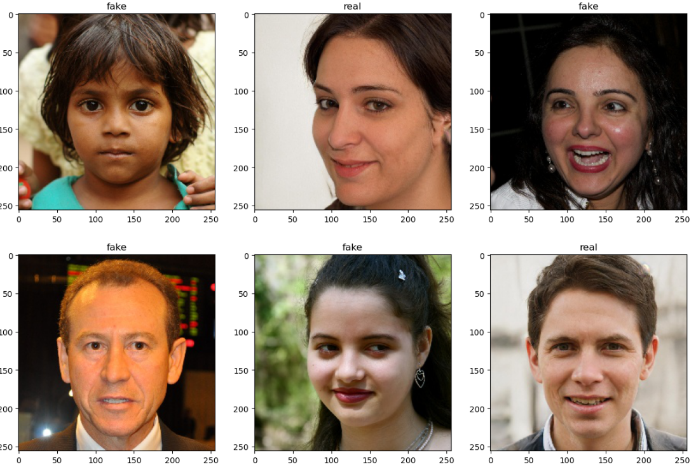
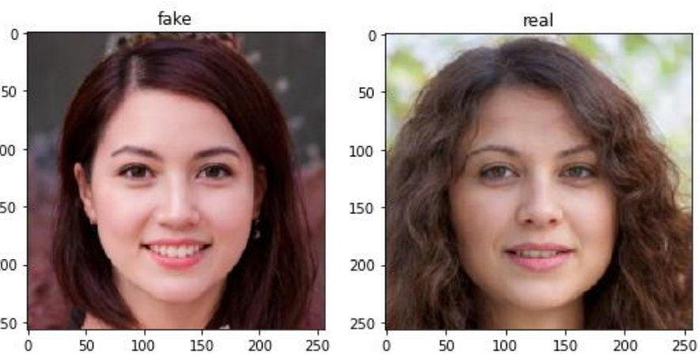

<h2>Real and Fake Faces Detection Using Deep Learning CNN</h2>

<h3>Abstract:</h3> 
Artificial intelligence (AI), deep learning, machine learning and neural networks represent extremely exciting and
powerful machine learning-based techniques used to solve many real-world problems.
Artificial intelligence is the branch of
computer sciences that emphasize the development of intelligent machines, thinking and working like humans. 
Deep learning is a subset of machine
learning in artificial intelligence that has networks capable of learning unsupervised from data that is unstructured or
unlabelled. 
Deep learning is a technique used to generate face detection and recognize it for real or fake by using profile images and determine the differences between them.
<h3>Problem Statement:</h3>
According to use of social media, we will encounter a fake identity from any person through using fake profile image. The
fake profile image can be occurred with using image editor, face effect, or any program using to change the facial features.
Effects on the face can change facial features and it’s difficult to know true identity for someone. In this application, we hope to train
a model using the dataset to recognize such fake faces.
Computerized applications can use deep learning techniques to increase accuracy and efficiency in diagnosis. These include human
images, image processing techniques and data analysis.

 <h3>Objectives of the Study:</h3>
Main objective for this study is implementation a software model used to detect and classify 
face to real or fake for expert generated high-quality photo shopped face images. 
Other objectives are: 
• Detect fake face images rapidly.
• Get high accuracy and validation in the testing and training images.
• Training high dataset of fake and real human face to see an accuracy of the result.
<h3>Convolutional Neural Network (CNN):</h3>
Technically, deep learning CNN models to train and test, each input image will pass it 
through a series of convolution layers with filters (Kernels), polling, fully connected layers 
(FC) and apply sigmoid function to classify an object with probabilistic values between 0 and 1.
<h3>Dataset : </h3>
The data set in this study consists of 14K human faces of real-fake images. The numbers of images in this dataset are classified as follows: 70K images that were real human faces, 70K of fake. The dataset of real-fake human faces images was collected from Kaggle website.
Dataset available in the link :
https://www.kaggle.com/datasets/xhlulu/140k-real-and-fake-faces

<h3>Methodology:</h3>
My Proposed methodology includes gathering the dataset, identifying the tools and language to be used, pre-processing the images in the dataset, data augmentation, and construction of the model architecture, compiling the model, training and validating the model.
<h3>Language And Tool Used :</h3>
 Python language was used, which is an interpreted, high-level, general-purpose programming language. It was created by Guido van Rossum and first released in 1991, Python's design philosophy emphasizes code readability with its notable use of significant whitespace. Its language constructs and object-oriented approach aim to help programmers write clear, logical code for small and large-scale projects [8-9]. Python is dynamically typed, and garbage collected. It supports multiple programming paradigms, including procedural, object oriented, and functional programming. Python is often described as a "batteries included" language due to its comprehensive standard library. 
<h3>Environments:</h3>
1-	Spyder
2-	 Jupyter
 Library used in the development model:
 Sklearn, TensorFlow, NumPy, pandas, matplotlib, keras.

<h3>Evaluation :</h3>
In this study, we used deep learning techniques to generate models for Real and Fake face
detection. 
The goal is determining a suitable way to detect real and fake faces. The model was designed and implemented, including
 Dataset of images: Real and Fake faces detection using Deep 
 learning algorithms based on neural networks. We have trained dataset which consists of 
140000 images for total in 20 epochs, with 89.87% training accuracy, testing accuracy 
89.16 %, training loss 0.0233 %, validation loss 0.0233 %.
 

<h3>Validating: </h3>

We created a model from scratch with 5 convolutional layers followed by a fully connected hidden layer. Real And Fake Face Detection Output layer uses sigmoid activation as it must output the probability for each of the input, to optimize the network Adam optimizer and a learning rate=1e-4 were used. I trained and validated my model, and I got a training accuracy of 89.87 %, testing accuracy 89.16 % and validation accuracy of 90.9 %.

